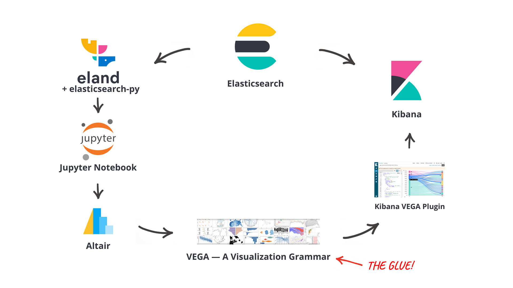
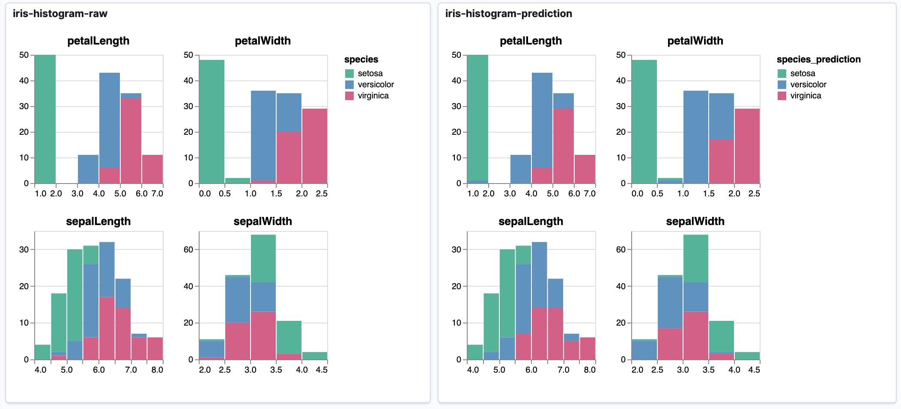

# A Workflow for Data Scientists to bring Jupyter Notebook Visualizations to Kibana Dashboards

This repository consists of several Jupyter Notebooks to demonstrate a workflow mainly using Altair to develop visualizations which can be published to Kibana Dashboards. One of the main benefits of this approach is that a data scientist can continue to work with the environment they are most familiar with, without touching raw VEGA JSON specifications or coding custom JavaScript visualizations.

## Notebooks

### [1a-flights-histogram.ipynb](https://walterra.github.io/jupyter2kibana/viz-1a-flights-histogram.html)

This covers how to get data via *eland* from Elasticsearch and discussed some different approaches how to visualize small multiples of binned histograms with *eland* and *Altair*. It covers the basic requirements to successfully create and publish a custom visualization from  *Jupyter* to *Kibana*.

### [1b-flights-splom.ipynb](https://walterra.github.io/jupyter2kibana/viz-1b-flights-splom.html)

This notebooks builds on the learning from the first one and uses the same data to create and deploy a scatterplot matrix. The difference here is that we moved the code to create the *SavedObject* in *Kibana* to a helper function into *kibana_vega_util.py* so we can reuse it.

The two visualizations can be combined in a single dashboard and will consider filters added via the KQL query bar:

### [2a-cars-splom.ipynb](https://walterra.github.io/jupyter2kibana/viz-2a-cars-splom.html)

With this notebook we're creating another scatterplot matrix using the *cars* dataset you might know from *Vega*. However, this time we're taking the data from outside *Elasticsearch* and index it using *eland*.

### [2b-cars-outlier.ipynb](https://walterra.github.io/jupyter2kibana/viz-2b-cars-outlier.html)

Before moving on with this notebook, we used Elasticsearch's Machine Learning to detect outliers on the *cars* dataset. We then use the newly created index including the outlier metadata in this notebook to create a scatterplot matrix that highlights these outliers. Additionally it includes a *Vega* based slider to adjust the threshold for highlighting.

### [2c-cars-violin.ipynb](https://walterra.github.io/jupyter2kibana/viz-2c-cars-violin.html)

The final chart for this second dashboard is a violin chart to show the distribution of *Miles per Gallon* over different areas.

### [3a-iris-classification](https://walterra.github.io/jupyter2kibana/viz-3a-iris-classification.html)

This notebook demonstrates how small multiples of stacked bar chart histograms can be used to evaluate machine learning results, in this case comparing original values to predicted categorizations.

### [4a-anomaly-detection.ipynb](https://walterra.github.io/jupyter2kibana/viz-4a-anomaly-detection.html)

This notebook demonstrates how to replicate one of the custom charts of Kibana's Machine Learning plugin as an embeddable chart for dashboards.

### [4b-anomaly-detection-annotation.ipynb](https://walterra.github.io/jupyter2kibana/viz-4b-anomaly-detection-annotation.html)

On top of the previous example this adds user created annotations as an additional layer to the visualization. It's a great example of how *VEGA* is able to fetch data from different sources/indices, something not easily doable with Kibana's own visualizations.

### [4c-anomaly-detection-split.ipynb](https://walterra.github.io/jupyter2kibana/viz-4c-anomaly-detection-split.html)

In this example we're back at using small multiples to visualize data about distinct entities with highlighted anomalies.

